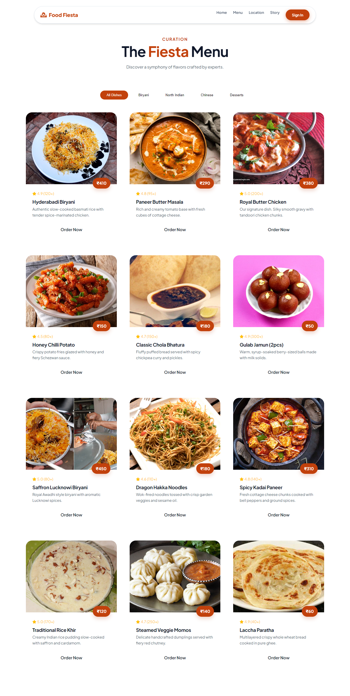
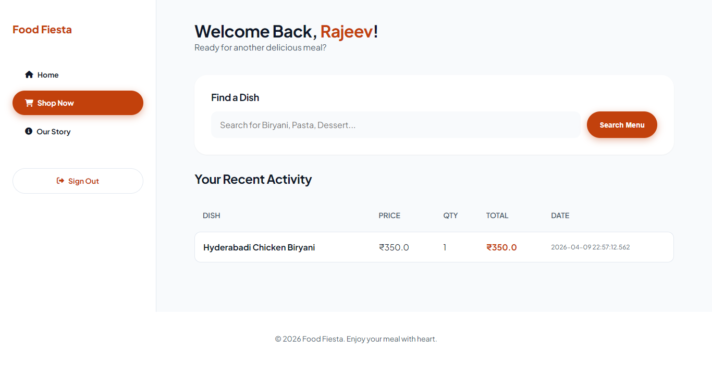
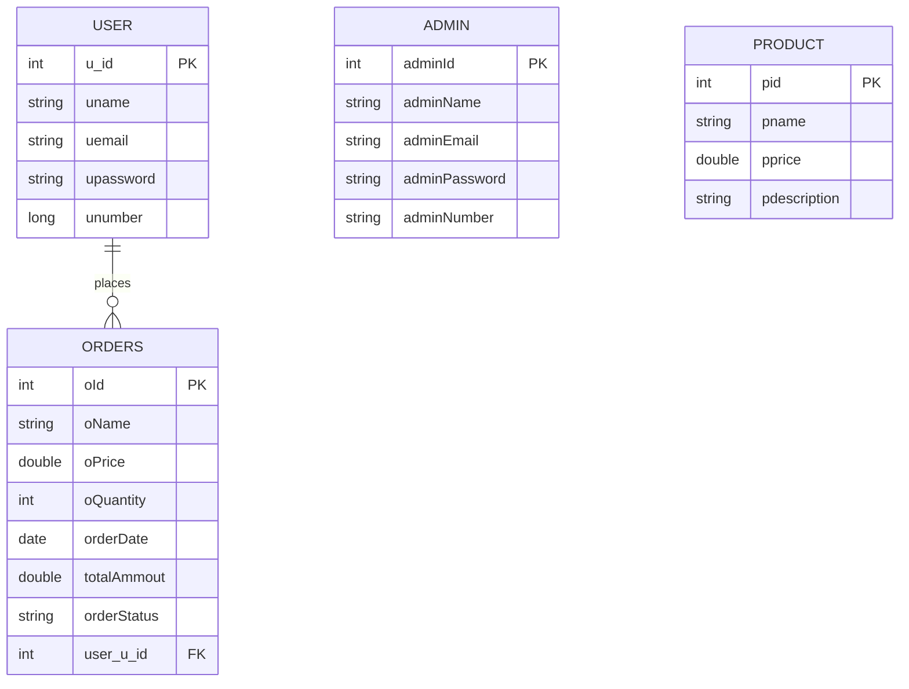

# Food Fiesta 🍽️ - Royal Restaurant Management System

**Food Fiesta** is a premium fullstack restaurant management application built with **Java 21**, **Spring Boot 3.4.2**, **Thymeleaf**, **Spring Security**, **Spring Data JPA**, and **H2** for quick local development. The project features a dual-interface system for customers and administrators with comprehensive CRUD operations and analytics.

Live Demo: [http://localhost:8081](http://localhost:8081) | Admin: `admin@foodfiesta.com` / `admin123`

---

[](https://spring.io/projects/spring-boot)
[](https://www.oracle.com/java/)
[](https://www.h2database.com/)
[](https://swagger.io/)
[](https://www.thymeleaf.org/)
[](LICENSE)

---

## 🚀 Features

### 👑 Admin Dashboard
- **Overview Dashboard** - Revenue stats, order volume, items sold, registered customers, and staff counts
- **Product Popularity Analytics** - Best seller tracking with sales metrics per dish
- **Customer Order Summary** - Per-user spending, order counts, and VIP/Gold/Regular tier badges
- **Menu Management** - Full CRUD (Add/Edit/Delete) for dishes with search filtering
- **Order Transactions** - Complete order lifecycle with status tracking (Pending → Preparing → Completed/Cancelled)
- **Customer Accounts** - User management with full CRUD operations
- **Admin Management** - Staff account creation and permissions management
- **CSV Export** - One-click export of orders table to CSV
- **Live Search** - Real-time table filtering across all sections

### 👤 Customer Portal
- **User Registration & Login** - Self-registration and secure authentication
- **Product Browsing** - Browse royal menu with dish categories and descriptions
- **Order Placement** - Select dishes, set quantities, and place orders
- **Order History** - View past orders with dates and amounts
- **Multi-Select Checkout** - Select multiple orders and checkout with grand total calculation
- **Order Success Screen** - Confirmation with total amount and confetti animation

### 🔐 Security
- **Session-based Authentication** - Custom `SessionAuthenticationFilter` for admin and user sessions
- **Role-based Access** - Separate admin and customer login portals
- **Optional Google OAuth2** - Pre-configured Google login integration

---

## 📸 Screenshots

| Home Page | Admin Dashboard |
|:---------:|:--------------:|
|  |  |
| **Products** | **User Login** |
|  |  |

---

## 🛠️ Technology Stack

| Layer | Technology |
| :--- | :--- |
| **Backend** | Java 21, Spring Boot 3.4.2, Spring Security, Spring Data JPA, Hibernate |
| **Database** | H2 (file-based for dev), PostgreSQL (production-ready) |
| **Frontend** | Thymeleaf, HTML5, CSS3 (custom design system), Vanilla JavaScript |
| **Styling** | Premium design system with CSS custom properties, glassmorphism, gold accents |
| **Build Tool** | Apache Maven (with wrapper) |
| **API Docs** | SpringDoc OpenAPI / Swagger UI |
| **Auth** | Session-based + Google OAuth2 (optional) |

---

## 📊 Database Schema



---

## 🚦 Quick Start

### Prerequisites
- JDK 21+
- Git

### Run Locally

```bash
# Clone the repository
git clone https://github.com/rockyrakes/FoodFiestaMain.git
cd FoodFiestaMain

# Run with Maven Wrapper
.\mvnw.cmd spring-boot:run
```

### Access the Application

| URL | Description |
|:---|:---|
| http://localhost:8081/ | Home Page |
| http://localhost:8081/login | Admin & User Login |
| http://localhost:8081/admin/services | **Admin Dashboard** |
| http://localhost:8081/swagger-ui/index.html | Swagger API Docs |
| http://localhost:8081/h2-console | H2 Database Console |

### Default Login Credentials

| Role | Email | Password |
|:---|:---|:---|
| **Admin** | admin@foodfiesta.com | admin123 |
| **User** | Register via /register or ask admin to create |

---

## 📋 Admin Dashboard Sections

The admin panel at `/admin/services` contains:

1. **📊 Stats Overview** - 7 stat cards: Revenue, Avg Order Value, Menu Items, Items Sold, Orders, Customers, Admins
2. **🔥 Product Popularity** - Sales per dish with Best Seller / Popular / Standard badges
3. **👥 Customer Order Summary** - Per-user analytics with Royal VIP / Gold / Regular tiers
4. **🍽️ Menu Management** - Full product CRUD with live search
5. **📄 Order Transactions** - Complete order management with status badges and CSV export
6. **👤 Customer Accounts** - User CRUD management
7. **🛡️ Administrators** - Admin CRUD management

---

## 🔧 Configuration

### Application Properties (`src/main/resources/application.properties`)

```properties
server.port=8081
spring.datasource.url=jdbc:h2:file:./data/foodfiesta
spring.jpa.hibernate.ddl-auto=update
spring.h2.console.enabled=true
```

### PostgreSQL (Production)
Edit `application.properties`:
```properties
spring.datasource.url=jdbc:postgresql://localhost:5432/foodfiesta
spring.datasource.username=postgres
spring.datasource.password=YOUR_PASSWORD
spring.jpa.properties.hibernate.dialect=org.hibernate.dialect.PostgreSQLDialect
```

### Google OAuth2
```properties
spring.security.oauth2.client.registration.google.client-id=YOUR_CLIENT_ID
spring.security.oauth2.client.registration.google.client-secret=YOUR_CLIENT_SECRET
```

---

## 🐳 Docker Deployment

```bash
# Build image
docker build -t food-fiesta .

# Run container
docker run -p 8081:8081 --name food-fiesta-app food-fiesta

# Or with Docker Compose (includes PostgreSQL)
docker compose up -d
```

---

## 📦 Build

```bash
# Clean build
.\mvnw.cmd clean package

# Run tests
.\mvnw.cmd test
```

---

## 📁 Project Structure

```
Food-Fiesta-main/
├── src/main/
│   ├── java/com/example/demo/
│   │   ├── config/          # Security, OpenAPI, DataLoader
│   │   ├── controllers/     # Admin, User, Product, Order, Home
│   │   ├── entities/        # Admin, User, Product, Orders
│   │   ├── repositories/    # JPA Repositories
│   │   ├── services/        # Business logic layer
│   │   ├── loginCredentials/# Login DTOs
│   │   └── count/           # Utility (Logic.java)
│   └── resources/
│       ├── static/
│       │   ├── css/          # Main.css, Admin_Page.css, etc.
│       │   ├── JavaScript/   # Client-side scripts
│       │   └── Images/       # UI images & food photos
│       └── templates/        # Thymeleaf HTML templates
├── Dockerfile
├── docker-compose.yml
└── pom.xml
```

---

## 📄 License

Distributed under the MIT License. See [LICENSE](LICENSE) for details.

---

## 👨‍💻 Author

**rockyrakes**

[](https://github.com/rockyrakes)

---

> *"Where every meal is a royal feast"* 👑🍛
